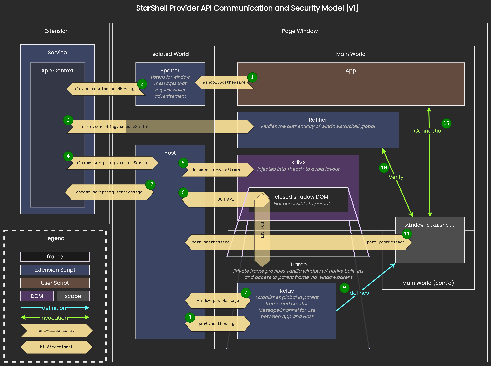

# StarShell Source Code Documentation

These documents are intended to help developers, auditors, and code reviewers read/navigate the source code understand high-level components of the project, including its approaches to privacy and security.

## Getting Started

Before diving into any of the code, please see this brief note on the [Coding Conventions](variable-prefix-semantics.md) used in this project.

## Source Code Directory Structure

Under the [`src/`](/src) directory:

 - `app` - source code for the app's user interface
   - `container` - structural svelte components
     - `system` - subcomponents that augment the primary display
   - `frag` - svelte components that encapsulate some custom, reusable app element
   - `nav` - 
   - `popup` - svelte components for each various popup view
   - `screen` - svelte files that correspond to individual screens in the app
   - `style` - importable Less CSS files
   - `svg` - svelte files needed to generate inline SVG elements dynamically
   - `ui` - svelte screen elements for composing views
 - `chain` - 
 - `crypto` - functions related to cryptography and cryptocurrency protocols
 - `entry` - application entrypoint HTML files and their loader ES modules
 - `extension` - functions related to web extension compatibility and maintenance 
 - `icon` - SVG files used for user interface elements
 - `meta` - type definitions for JSON objects that are (de)serialized into `chrome.storage.local`
 - `provider` - 
 - `schema` - 
 - `script` - "headless" content scripts responsible for communication and asynchronous tasks
 - `share` - functions and constants used by both the app ui and the content scripts
 - `states` - 
 - `store` - 
 - `style` - independent Less CSS files
 - `util` - utility, pure functions

## Privacy and Security

All things related to the privacy and security components.

<!-- 
### Provider API

When a web dApp wants to read/write data to/from the blockchain through a wallet extension, the user is exposing themselves to a non-trivial amount of privacy and security risks.

StarShell does not follow the de facto interaction paradigm that happens between web dApps and wallet extensions. Instead, we've engineered a process that establishes a connection with the web dApp, allowing it to request permissions and allowing the wallet to hide or obscure information from the dApp itself.

These concepts are summarized in the following article:

[Web3 Wallets Have Serious Privacy and Security Flaws](https://medium.com/@starshellwallet/web3-wallets-have-serious-privacy-and-security-flaws-5023f8f872b1)

Put into practice, our holistic approach to protecting user privacy and mitigating against malicious co-installed extensions is represented in the following diagram:

The following sections break down this process.

#### Terms:
 - _App_ - the web application, distributed by some web page, that intends to connect with the user's wallet.
 - _Spotter_ - a content script executed by StarShell in the isolated world of every web page, run at `document_start`, that only listens for messages on the top-level frame `window`, filtering them and deciding which to forward onto the extension's _Service_.
 - _Service_ - StarShell's service worker (or background page in Manifest V2 deployments).
 - _Host_ - a content script executed by StarShell in the isolated world of approved web pages, injected upon advertisement, responsible for handling messages from _App_ once a connection has been established.
 - _Relay_ - an injected script executed by StarShell run in a vanilla frame within the main world of an approved web page.
- _Ratifier_ - an injected script that ratifies the authenticity of the `window.starshell` object, in order to prevent a hypothetical scenario in which a malicious co-installed extension attempts to hijack or interfere with the StarShell API between the web page and the web extension.

#### Process Flow

1. The _App_ requests an advertisement by posting a specific message to its own top-level frame `window`.

2. The _Spotter_ observes the advertisement request, verifies the message's origin and shape, and ultimately forwards the request to the _Service_.

3. The _Service_ checks that the wallet is unlocked, checks the page's origin against an internal policy set (which includes a global blacklist from 'headquarters' as well as any user-defined rules), checks the 'app permissions' associated with the page origin (prompting the user if the app has not been approved), and finally conducts the advertisement phase by injecting and executing the _Ratifier_ directly into _App_'s main world.

4. The _Service_ also then immediately loads and executes the _Host_ content script in page's isolated world.

5. The _Host_ creates a special DOM tree and appends it into the `<head>` element of _App_ in order to avoid affecting any layout-specific properties related to _App_'s `<body>`.

6. The special DOM tree contains a closed shadow DOM element which renders an untouchable `<iframe>` into the page. This `<iframe>` creates a vanilla `window` object complete with true natives and built-ins, preventing _App_ from overriding, mutating, or otherwise modifying any identifiers, functions, etc. This vanilla window object provides StarShell the guarantee that any scripts it executes within this frame cannot be hijacked or abused by _App_ or any other web extensions installed in the user's browser (even those that have registered to execute in `all_frames`).

7. The _Relay_ now has one-way access to _App_'s top-level frame `window` via `window.parent`. _Relay_ establishes a message channel with _Host_ to conduct the ratification phase.

8. The sequence of steps at this point is too complicated to accurately represent in the diagram, so pleae refer to the source code to get a better understanding of what actually happens around this time.

9. The _Relay_ uses its access to _App_'s top-level frame `window` to define the global object `window.starshell`.

10. The _Ratifier_ verifies the authenticity of the `window.starshell` global.

11. `window.starshell` receives a brand-new `MessageChannel` unique to each connection (i.e., per individual request made by _App_), that is able to post and receive messages directly with an instantiated handler residing in _Host_. 

12. The _Host_ notifies _Service_ that a new connection has been established with _App_.

13. _App_ is now able to communicate with the StarShell web extension via `window.starshell`. -->

### Private Key Management and Secp256k1

Many popular extension wallets follow similar practices with regards to managing private key material in memory. We contest these practices as being "secure enough", especially in the face of zero-day vulnerabilities at the browser, OS or hardware levels that could expose users to variants of cold-boot attacks.

In an effort to reduce this and adjacent attack surfaces, we identify what we see as the current risks associated with the aforementioned approaches and describe a set of techniques to mitigate them in the following article:

[The Failures of Web3 Wallet Security](https://medium.com/@starshellwallet/the-failures-of-web3-wallet-security-90311631e08c)

Put into practice, we leverage the platform's native handling of private key material (which ideally persists in protected memory regions) combined with a one-time pad persisted in our application's heap memory. When the time comes to use the private key, we recombine these two halfs of the one-time pad to derive the original private key in memory for a very short period in time; long enough to use it for signing, encryption or decryption, produce a new one-time pad, and then dispose of its contents in memory by zeroing out the bytes.

When it comes to secp256k1 signing and ECDH operations, we elected to avoid the commonly-used JavaScript implementations for several reasons:
 1. they all make use of ES strings to store private key material, which cannot be reliably zeroed out. for example, V8 uses string interning and the bytes from an unreachable string can live in memory long after its use.
 2. JavaScript execution has virtually no protection against timing attacks, and constant-time cryptographic operations are ostensibly impossible to implement.

Instead, we have opted to revive a defunct open-source project that creates a WASM module from the thoroughly tested libsecp256k1 C library. Performing secp256k1 cryptography in WASM ensures that private key material can be explicitly zeroed out while also ideally [providing protection against timing attacks](https://github.com/bitcoin-core/secp256k1#implementation-details).

[@solar-republic/wasm-secp256k1](https://github.com/SolarRepublic/wasm-secp256k1) is fork of that defunt project that merges with the libsecp256k1 upstream and fixes some build issues seen with the latest emscripten binary. It also adds support for the `ecdh` function provided by libsecp256k1 in order to derive a shared secret given a private key and another's public key.

The wallet uses this compiled WASM module for all secp256k1 operations including key generation, signing, verification, and derivation.

### Mitigating Supply-Chain Attacks

We employ [SES lockdown](https://github.com/endojs/endo/tree/master/packages/ses) to make intrinsics non-configurable in order to mitigate prototype-pollution from supply-chain attacks in runtime dependencies.

Taken a step further, we also harden `globalThis` by deeply freezing all of its properties with the custom `static/deep-freeze.js`, which is injected before the entry point script in each web extension HTML page (e.g., popup.html, flow.html). This mitigates targetted supply-chain attacks in runtime dependencies.

We do not yet have a solution to guard against supply-chain attacks in development dependencies. For example, if a svelte library or vite plugin were compromised, it is possible the attacker could inject malicious code into the output. However, the capabilities and limitations of such an attack are unclear.

### Content Security Policy

We use MV3's content security policy (CSP) to prevent foreign scripts, evals, and connections to unlisted servers.

